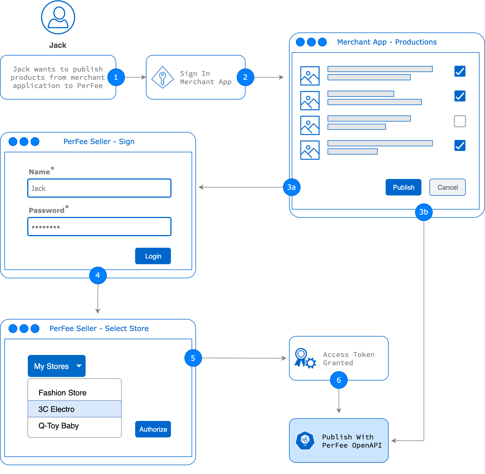

# OtokuWorld OpenAPI v2
通过符合 OAuth 2.0 规范的 API 体系向第三方卖家（店铺）管理工具厂商（ISV）、供应链平台、具备独立开发能力的卖家及合作伙伴提供涵盖商品管理、订单管理和店铺配置等卖家常用 API 接口，并持续开发更多有价值的应用接口。

## 整体结构


## 接入准备
### 申请新的应用程序接入认证
由 OtokuWorld 认证的独立卖家应用程序厂商（ISV）、供应链平台，具备研发能力的卖家可以申请新的应用程序认证，申请通过审核后，OtokuWorld 将提供应用程序 ID 和安全密钥。

### 卖家帐号
在 OtokuWorld 平台注册并通过审核的卖家，并至少拥有一个可以正常使用的店铺。  
> 注：接入测试阶段，OtokuWorld 将向应用开发者提供测试用卖家帐号和店铺）

## 授权方式
为确保卖家数据的安全，应用程序通过 API 使用卖家在 OtokuWorld 的数据（如商品、订单等）之前，需要取得 OtokuWorld 卖家的授权，由此获得使用卖家数据的授权访问令牌 Access Token。回此应用程序需要引导卖家完成使用 OtokuWorld 帐号登录授权的流程，该流程采用国际通用的 OAuth 2.0 规范作为用户身份验证与授权协议。目前 OtokuWorld OpenAPI 支持采用授权模式（Authorization Code）获取Access Token（授权令牌），详见如下说明。

API 定义技术文档:[https://apidocs.otoku_world.com/project/60/interface/api](https://apidocs.otoku_world.com/project/60/interface/api)

### 1. 请求入口地址

#### 1) 获取授权码（code）

* 测试环境: [https://openapi-test.otoku-world.com/v2/oauth/authorize](https://openapi-test.otoku-world.com/v2/oauth/authorize)
* 正式环境: [https://openapi.otoku-world.com/v2/oauth/authorize](https://openapi.otoku-world.com/v2/oauth/authorize)

#### 2) 获取访问令牌（access_token）

* 测试环境: [https://openapi-test.otoku-world.com/v2/oauth/token](https://openapi-test.otoku-world.com/v2/oauth/token)
* 正式环境: [https://openapi.otoku-world.com/v2/oauth/token](https://openapi.otoku-world.com/v2/oauth/token)

### 2. 授权操作步骤

#### 1) 拼接授权url

拼接用户授权需访问的url ，示例及参数说明如下:

* 示例:

```
https://openapi-test.otoku-world.com/v2/oauth/authorize?response_type=code&client_id=client_id_example&redirect_uri=http://www.oauth.net&state=1212&scope=seller
```
* 参数说明

| 参数名称 | 是否必须 | 示例 | 备注 |
| --- | --- | --- | --- |
| client_id | 是 | haodian_a85jNE | 请联系 OtokuWorld 申请 |
| redirect_uri | 是 | https://haodian.com/otoku_world/auth/callback | 由应用开发者提供回调地址，卖家登录授权后将跳转至此，并将在 URL 后随附授权码 |
| state | 是 | DT3141 | 任意字符串，开发者可用于传递授权会话上下文的相关信息 |
| scope | 是 | seller | 申请权限范围，可选值:1、seller。 |
| response_type | 是 | code | 授权类型，可选值:1、code。 |

#### 2) 引导用户登录授权

* 引导卖家用户通过浏览器访问以上授权url，如果卖家用户未处于登录状态，将弹出登录页面。卖家用户输入账号、密码登录，即可进入授权页面。

#### 3) 获取code

* 卖家用户进入授权页面后，选择需要授权的店铺store, 点击确认授权后，OtokuWorld授权服务将会把授权码code返回到回调地址上。应用可以获取并使用该code去换取access_token（注意code的有效期很短）
* 若用户未点授权而是点了“取消”按钮，则返回如下结果，其中error为错误码，error_description为错误描述。

#### 4) 换取access_token

* 换取access_token请求参数说明

| 名称 | 是否必须 | 示例 | 备注 |
| --- | --- | --- | --- |
| client_id | 是 | haodian_a85jNE | 请联系 OtokuWorld 申请 |
| client_secret | 是 | 4eA6LRP65sh5Bdht | 申请成功后可获得 |
| redirect_uri | 是 | https://haodian.com/otoku_world/auth/callback | 同获取授权URL |
| grant_type | 是 | authorization_code | 授权类型 ，可选值为authorization_code、refresh_token。当grant_type为authorization_code，应带上可选参数code；当grant_type为refresh_token时，应带上可选参数refresh_token。 |
| code | 否 |  | 上个步骤授权回调获取的code。 |
| refresh_token | 否 |  | 使用authorization_code方式授权时返回的refresh_token。 |

* code换取access_token示例
```shell
curl -i -d "code=6e0e89bed6987e9e2b540b42e91f5e77" \
    -d "grant_type=authorization_code" \
    -d "client_id=client_id_example&client_secret=client_secret_example" \
    -d "redirect_uri=http://www.oauth.net" \
    https://openapi-test.otoku-world.com/v2/oauth/token
```

* code换取access_token返回值示例
```shell
{
    "token_type": "bearer",
    "access_token": "access_token_example",
    "expires_in": 7200,
    "refresh_token": "refresh_token_example",
    "refresh_token_expires_in": 31104000
}
```
* refresh_token换取access_token示例
```shell
curl -i -d "grant_type=refresh_token" \
    -d "client_id=client_id_example&client_secret=client_id_example" \
    -d "redirect_uri=http://www.oauth.net" \
    -d "refresh_token=refresh_token_example" \
    https://openapi-test.otoku-world.com/v2/oauth/token
```

* refresh_token换取access_token返回值示例
```shell
{
    "token_type": "bearer",
    "access_token": "access_token_example",
    "expires_in": 7200
}
```


### 3.更多例子请参看samples和client_demo

### 4.接口错误信息
#### 接口如出错，会返回相应的错误信息的JSON文本，包含以下几个参数：
- error_code: 错误的内部编号
- error: 错误类型
- error_description: 错误的描述信息

#### 示例
```shell
{
    "error_code": 40001,
    "error": "invalid_parameter",
    "error_description": "Invalid parameter 'response_type'."
}

```

#### 错误码

| error_code | error | error_description | Http Code | 备注 |
| ---------- | ----- | ----------------- | --------- | --- |
| 40001 | invalid_parameter | some error message | 400 | 参数错误。 |
| 40002 | resources\_not\_found | some error message | 404 | 资源未找到。 |
| 40003 | unauthorized | some error message | 401 | 鉴权失败。 |
| 40004 | invalid_token | some error message | 401 | 无效的token。 |
| 40005 | invalid_operation | some error message | 400 | 无效的操作。 |
| 40006 | file\_upload\_failed | some error message | 400 | 上传文件失败。 |
| 40999 | unexpected_error | some error message | 500 | 未知错误。 |
